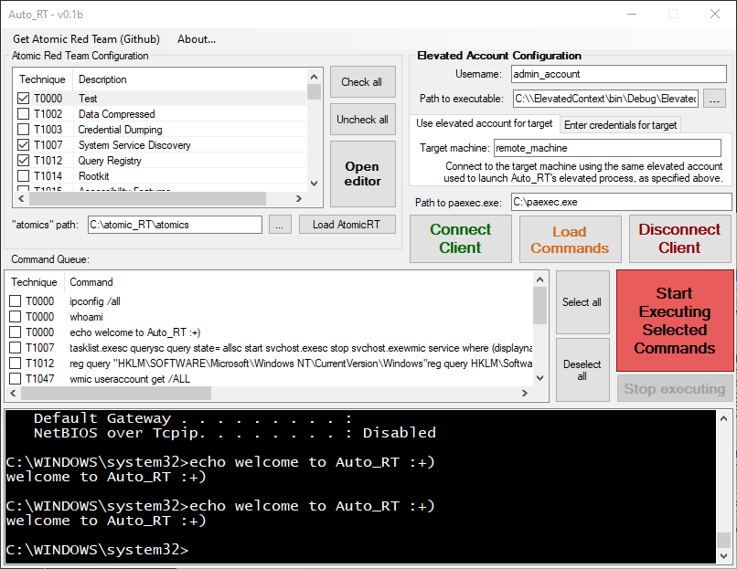
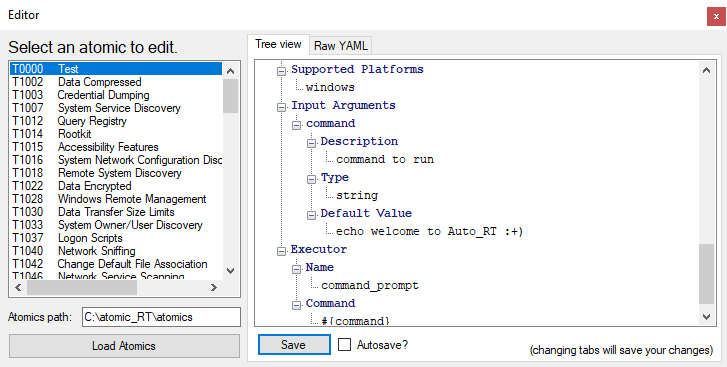
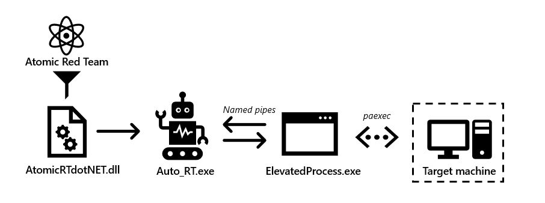
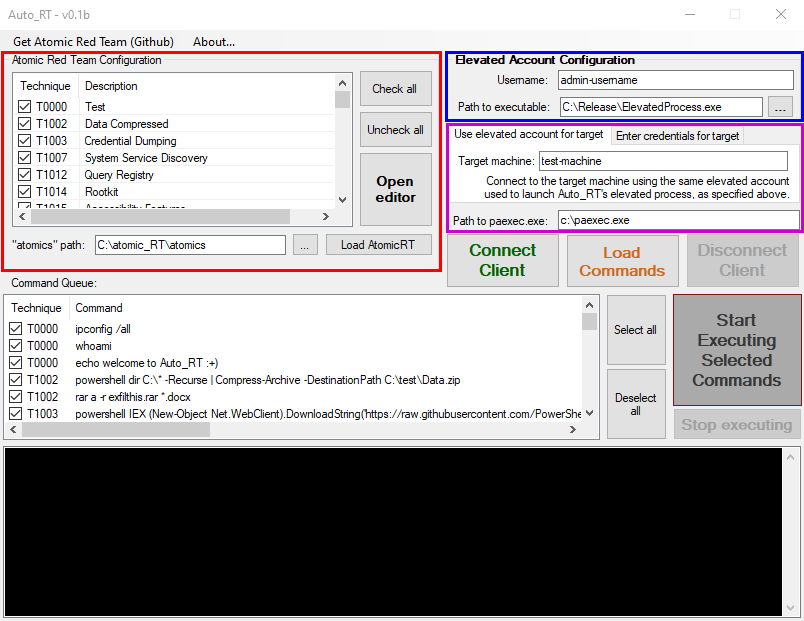

# Auto_RT (v0.1b)

A Windows tool for exploring, editing, and remotely executing [Atomic Red Team](https://github.com/redcanaryco/atomic-red-team) in Windows environments.

## How does Auto_RT v0.1b work?

 - Atomic Red Team's Windows commands are parsed into .NET objects by AtomicRTdotNET.dll
 - Auto_RT.exe hosts a secure named pipe server and launches ElevatedProcess.exe as its client.
 - ElevatedProcess.exe connects to the target machine via paexec.exe and redirects its IO streams over the named pipe.
 - Atomic Red Team commands are piped from Auto_RT.exe to ElevatedProcess.exe, which then executes them on the target machine.
 
## Installation
See [Releases](https://github.com/amacraek/auto_rt/releases) for binaries. 

## Usage

**1. Atomic Red Team Configuration (red)**
 - Clone [Atomic Red Team](https://github.com/redcanaryco/atomic-red-team) to your machine.
 - Enter the path to the "atomics" subdirectory of the Atomic Red Team repo. Click "Load AtomicRT" to populate the list view.
 - Select the techniques you want to queue, then click the orange "Load Commands" button to populate the command queue.
 - Click "Open editor" to open a simple explorer and editor for Atomic Red Team YAML files.

**2. Elevated Account Configuration (blue)**
 - Auto_RT's paexec wrapper, ElevatedProcess.exe, requires administrator privileges. Enter the username for an administrator account on your local machine.
 - Confirm the path to ElevatedProcess.exe

**3. Target Machine Configuration (magenta)**
 - If the administrator account needed to launch ElevatedProcess.exe above _is also_ an administrator on the target machine, then this account can be used to authenticate to the target machine (recommended) 
 - If you need to authenticate to the target machine using different credentials, you can specify plaintext credentials in the "Enter credentials for target" tab.
 - Confirm the path to paexec.exe

**4. Connect and execute!**
 - Once all fields are filled, you can click the "Connect Client" button. A UAC prompt will pop up for you to authenticate using the elevated account.
 - Check the commands you want to execute in the command queue, and click "Start Executing Commands".
 - Output will be displayed in the console.

## Notes from the author
Auto_RT v0.1b is the cleaned-up version of a project I originally wrote for my employer's Windows environment. The design choices were dictated by the requirements of that environment and the use case of the software.
In my opinion, the most valuable code here is the AtomicRTdotNET library, which parses Atomic Red Team into .NET objects, and the code I used to wrap paexec. Since this is all written in C#, I imagine much of the functionality of the GUI could be condensed into a powershell object for automation.

You can reach me at  if you'd like :+)

Alex MacRae-Korobkov
